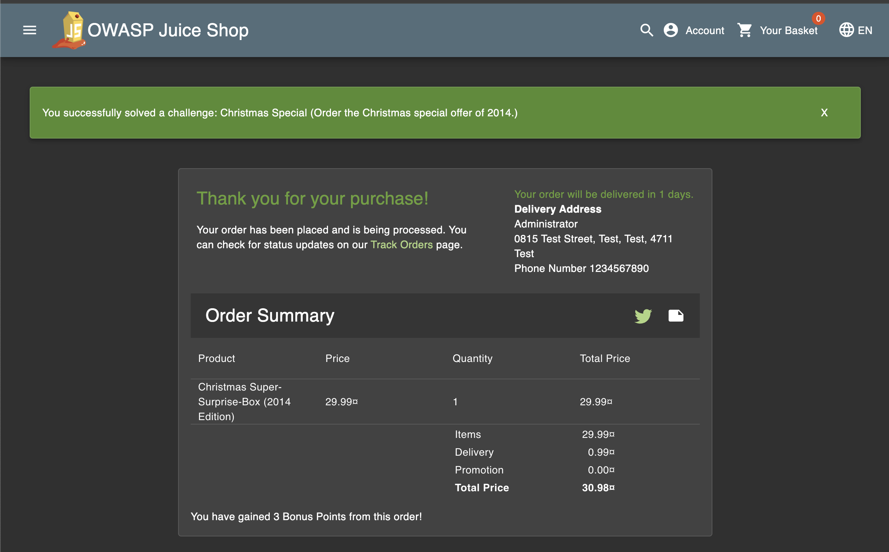
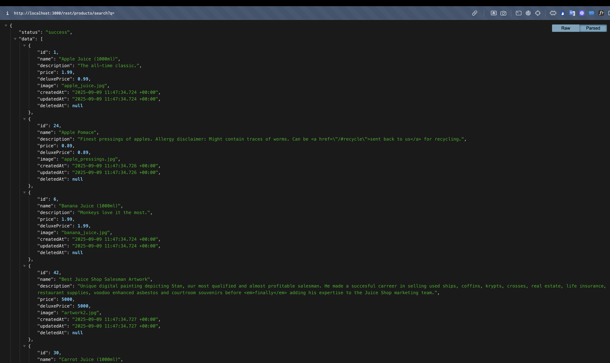
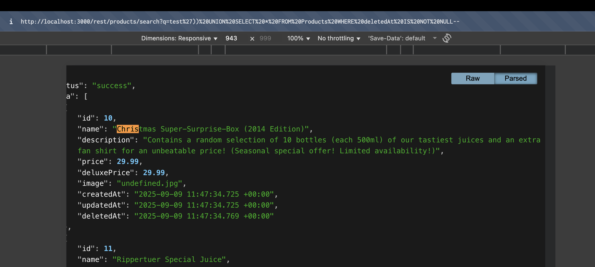
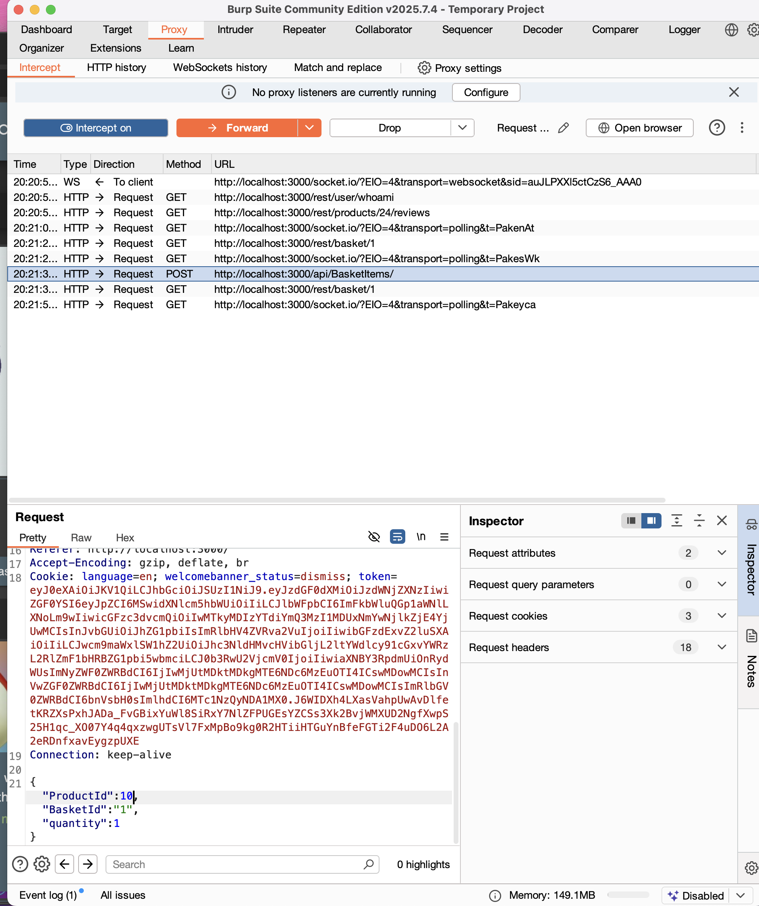
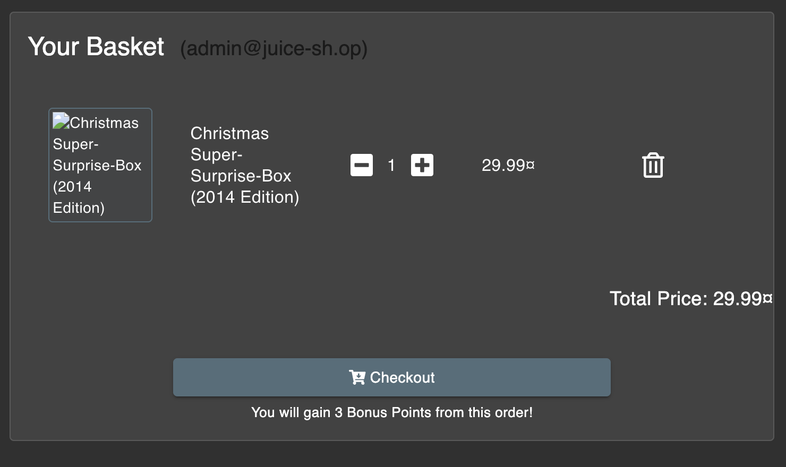

## Christmas Special

## Link Resource

http://localhost:3000/#/score-board?categories=Injection&showDisabledChallenges=false

## Jawaban + Bukti

### Step-by-step

1. pada kasus kali ini kita diminta untuk menemukan produk tersembunyi yang tidak tertampil di katalog biasa, sehingga kita memakai `/rest/products/search?q=')`. Namun tetap tidak tertampil karena produk “Christmas Special” sebenarnya ada di database, tapi diberi flag deletedAt (soft-deleted), makanya pada saat dicari ?q=christmas hasilnya kosong. Maka kita perlu memasukkan payload.

2. agar dapat mengetahui produk tersembunyi maka kita dapat memasukkan payload berikut ke dalam param q `test')) UNION SELECT \* FROM Products WHERE deletedAt IS NOT NULL--`

3. kemudian kita dapat menambahkan ke dalam bucket dengan melakukan injection pada id cristmas yakni = 10.

### Catatan

- Sukses Mendapatkan Produk Cristmas Special serta memesannya
