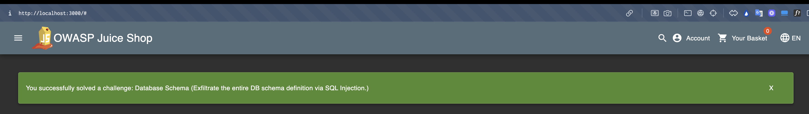
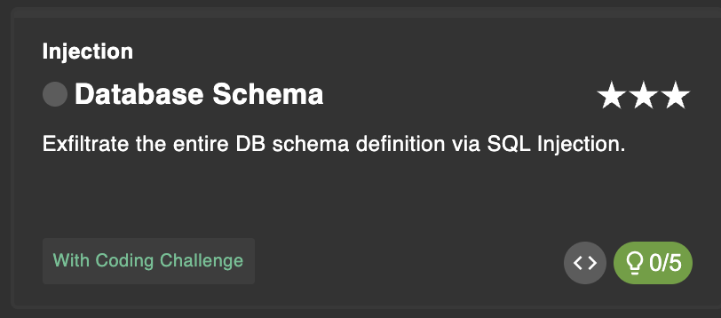
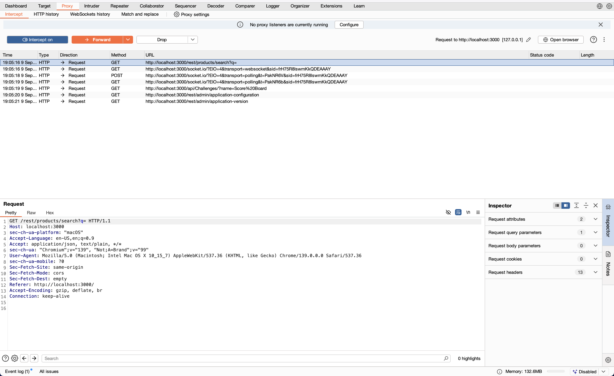
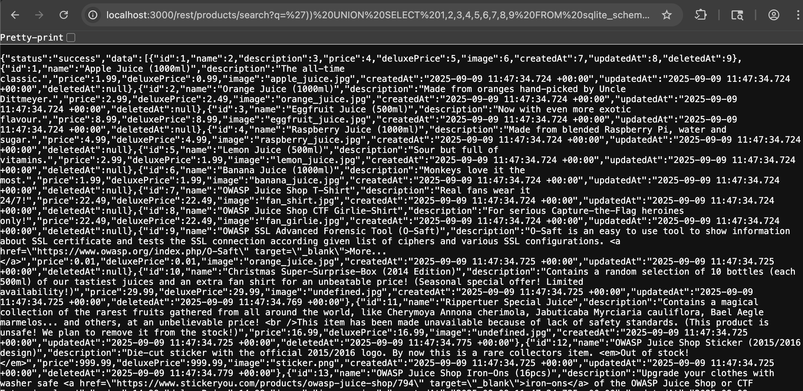
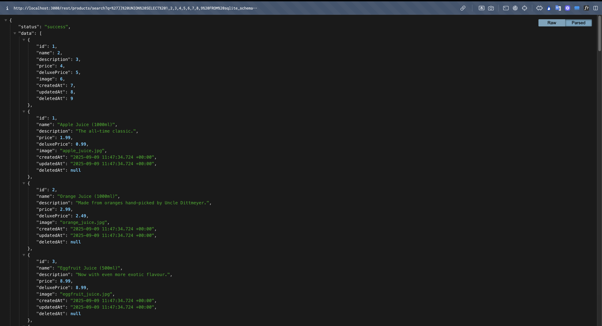

# Database Schema

## Link Resource

https://juice-shop.herokuapp.com/#/score-board?categories=Injection&showDisabledChallenges=false

## Jawaban + Bukti

### Step-by-step

1. pada soal database schema tersebut kita diberikan hint untuk mencari endpoint yang punya filter/search, maka dari itu kita dapat menggunaakn burpsuite untuk mencarinya

2. saat menggunakan burpsuite kita menangkap endpoint yang mana terdapat request berupa `GET /rest/products/search?q= HTTP/1.1` yang artinya, param q= (search query) bisa kita manipulasi untuk uji SQL Injection.

3. lanjut `send to repeater` untuk melakukan injection sembari mencari hasil response, apabila valid berarti jumlah kolom bernilai 9`/rest/products/search?q=')) UNION SELECT 1,2,3,4,5,6,7,8,9 FROM sqlite_schema--`

4. kemudian format menjadi raw agar lebih rapi dan kita dapat melihat dengan baik schema database dari juice shop

### Catatan

- Berhasil menampilkan definisi tabel dari sqlite_schema
