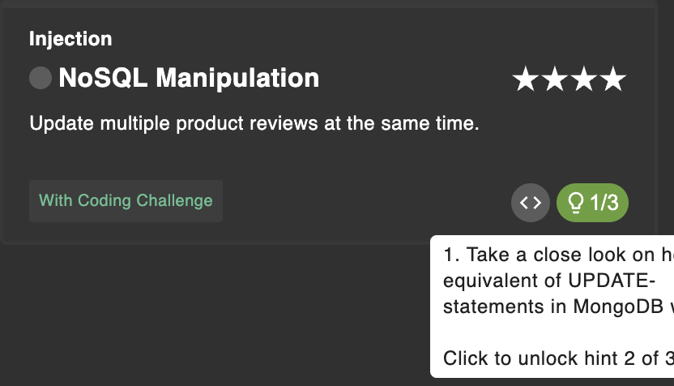
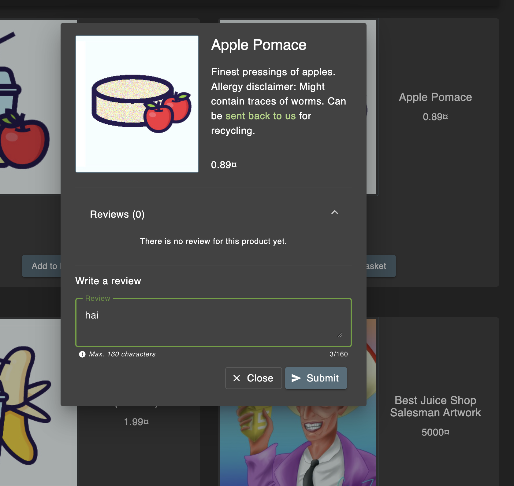
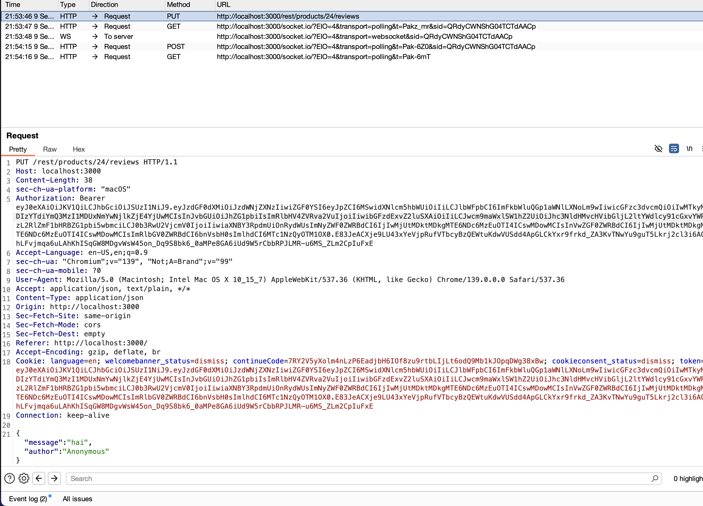
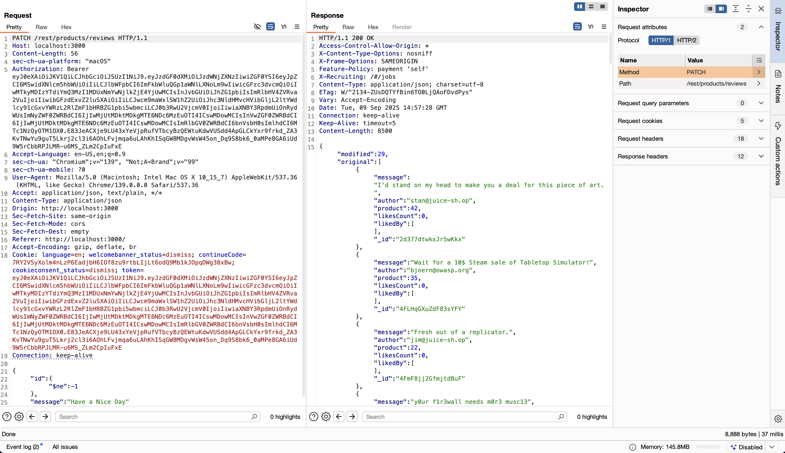

# NoSQL Manipulation

## Link Resource

https://juice-shop.herokuapp.com/#/score-board?categories=Injection&showDisabledChallenges=false

## Jawaban + Bukti

### Step-by-step

1. pada soal kali ini kita diminta untuk memperbarui ulasan produk secara bersamaan, dimana kita dapat mengguakan burpsuite untuk melakuka update nya

 2. pada bagian comment maka kita dapat menangkapnya menggunakan burpsuite

3. disini kita dapat mencari sebuah message yang ada dan juga diserta dengan bearer authenticaiton

 4. yang mana pada saat kita send ke repeater maka pada inspector kita ubah yang awalnya PUT menjadi PATCH, serta memodif message dan menghapus id products sebagaiamana pada gambar.

### Catatan

- berhasil memperbarui ulasan produk
