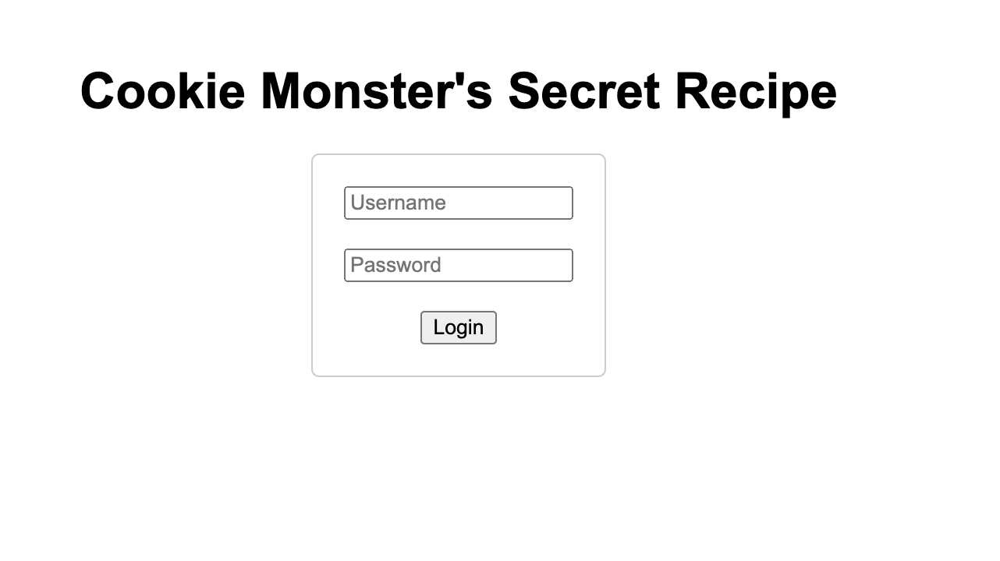

# Cookie Monster Secret Recipe

## Link Resource

picoCTF : https://play.picoctf.org/practice/challenge/469?category=1&page=1

## Jawaban + Bukti

berhasil mendapatkan flag.

### Step-by-step

1. pada gambar tersebut kita bisa memulainya dengan menekan button 'launch instane' agar kita dapat me-running soal tersebut

2. akan diberikan waktu 15 menit untuk menyelesaikan soal tersebut dan apabila waktu habis maka harus me restart kembali servernya

3. selanjutnya kita dapat menekan klik 'here' untuk mulai mengerjakannya

4. maka akan tertampil sebagaimana gambar diatas, selanjutnya kita dapat memasukkan sembarang input untuk mendapatkan cookie nya

5. maka akan tertampil seperti itu, yang mana kita dapat mengecek lebih jauh menggunakan inspect element.

6. dari sini di bagian cookie kita dapat melihat adanya 'secret_recipe' dimana kita mendapatkan hint untuk valuenya yang mana ini berupa string yang bisa kita decode untuk menemukan flag nya.

7. dimana disini saya menggunakan 'cyberchef' untuk proses decodenya dan berhasil menemukan flagnya.

### Catatan

- Sukses mendapatkan flag dari cookie
