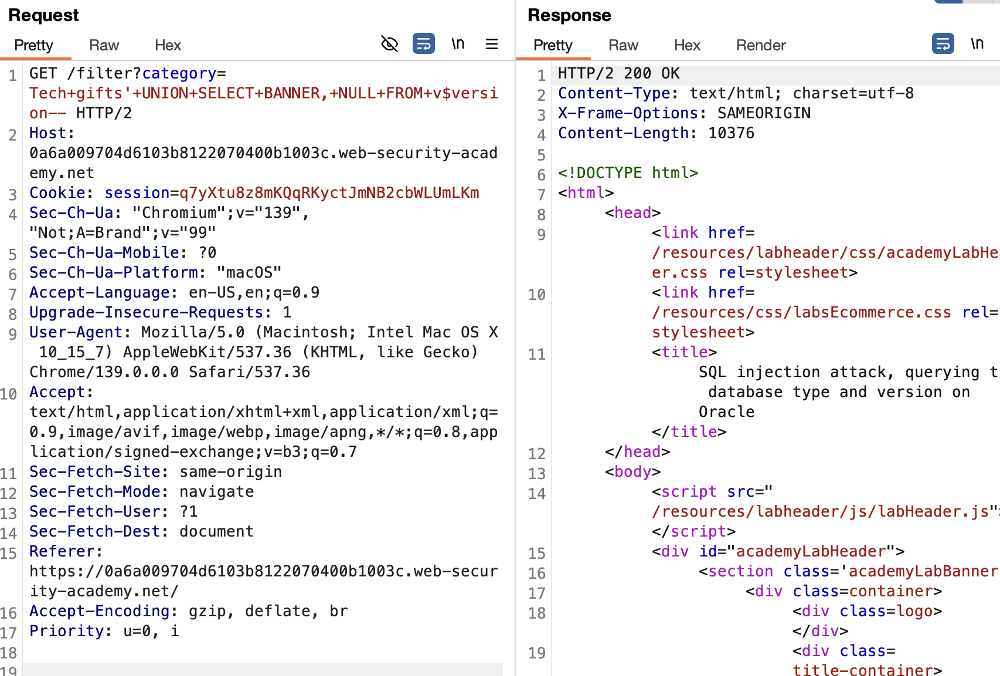

# SQL Injection

## Link Resource

https://portswigger.net/web-security/sql-injection/lab-login-bypass

## Jawaban + Bukti

### Step-by-step

1. pada soal kali ini kita diminta kamu menampilkan database version string dari server Oracle dengan teknik UNION SELECT injection.

2. kemudian kita intercept request menggunakan burpsuite pada kategori Tech gifts

3. Ubah parameter category jadi payload injection menggunakan `'+UNION+SELECT+BANNER,+NULL+FROM+v$version—`

4. cek response di burpsuite apabila berhasil maka akan muncul database version string.

### Catatan

- SQL Injection
