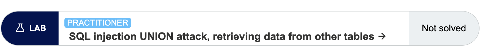
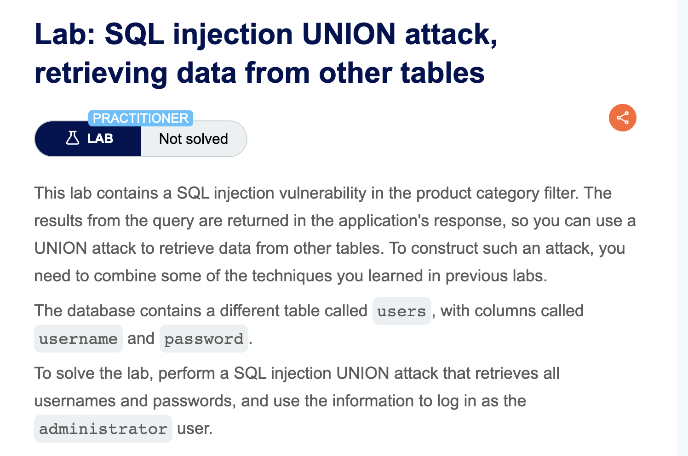
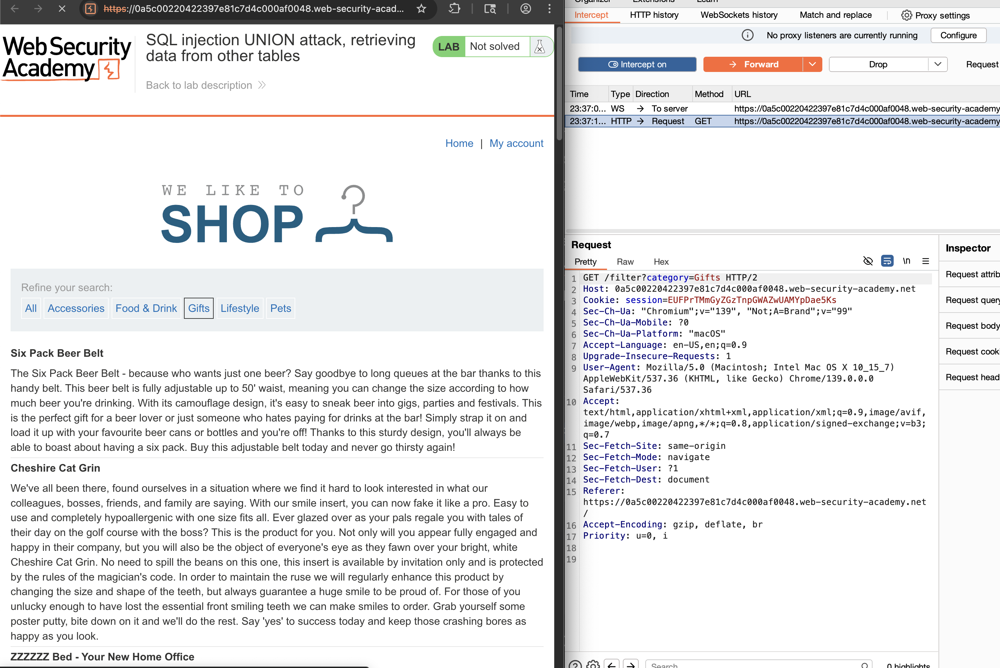
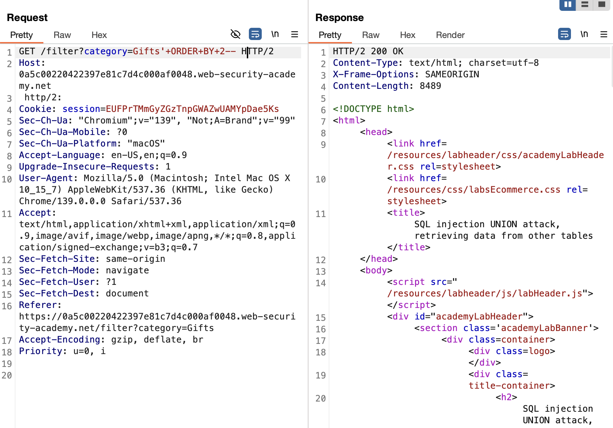
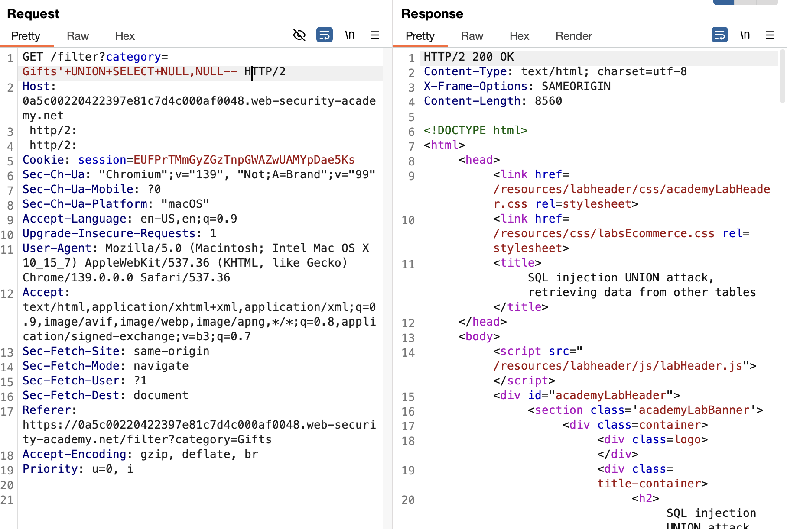
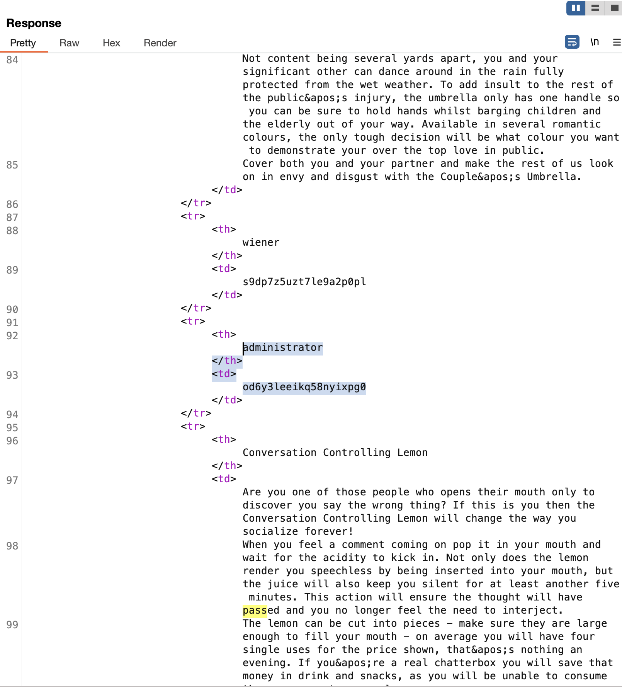
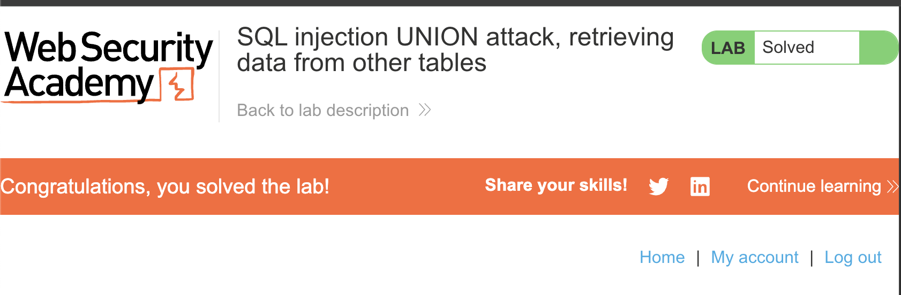

#

## Link Resource

## Jawaban + Bukti

### Step-by-step

1. pada lab kali ini kita diminta untuk melakukan UNION-based SQL injection supaya bisa mengambil data username dan password dari tabel users, lalu login sebagai administrator.

2. kemudian kita melakukan intercept requeet di burpsuite

3. kemudian kita mengganti kolom Gifts menggunakan payload `/filter?category=Gifts'+ORDER+BY+2--` jika tidak error berarti minimal 2 kolom.

4. lalu tes union select menggunakan payload `/filter?category=Gifts'+UNION+SELECT+NULL,NULL--` kalau respon normal berarti valid

5. kemudian ambil data dari tabel users menggunakan payload `/filter?category=Gifts'+UNION+SELECT+username,password+FROM+users--`

6. lalu kita login mengggunakan username dan password tersebut

### Catatan

- Berhasil mendapatkan username dan password untuk login
