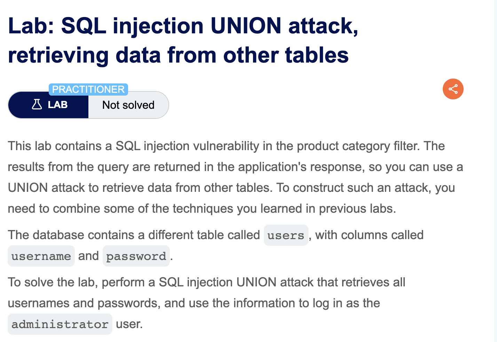
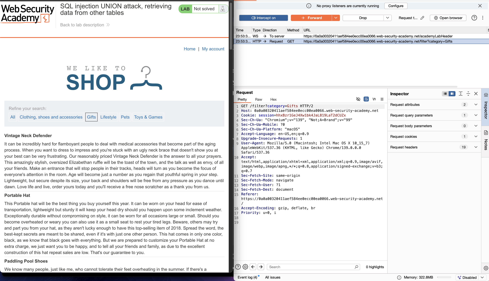
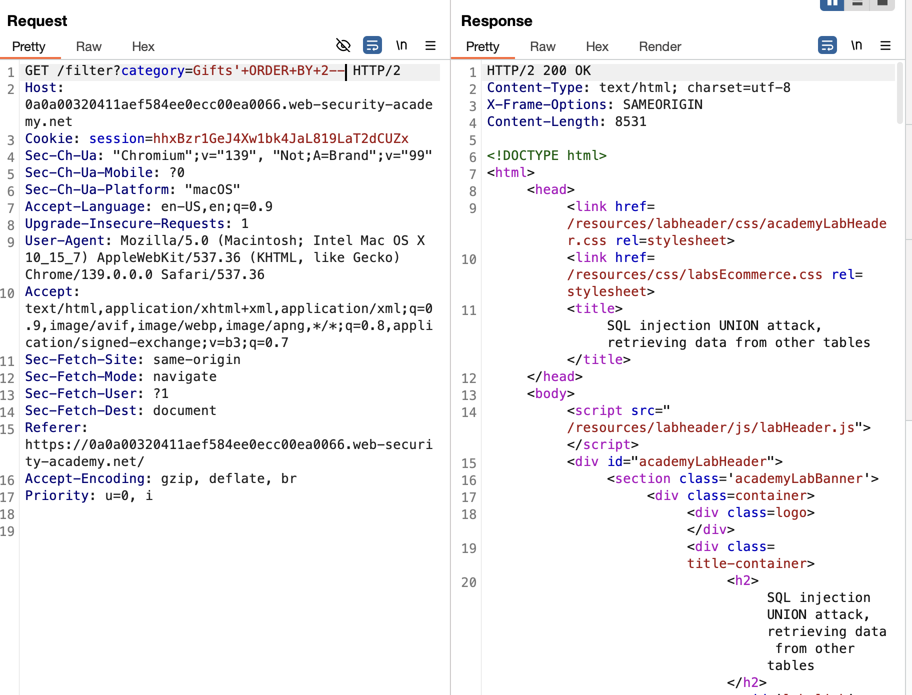

# SQL injection UNION attack, retrieving multiple values in a single column

## Link Resource

https://portswigger.net/web-security/sql-injection/union-attacks/lab-retrieve-multiple-values-in-single-column

## Jawaban + Bukti

### Step-by-step

1. pada lab ini kita diminta untuk:

- Menggunakan UNION-based SQL injection
- Menggabungkan (concatenate) nilai username dan password ke dalam satu kolom hasil query.
- Mendapatkan kredensial administrator.

2. kita dapat menggunakan burpsuite untuk melakukan intercept pada kategori gifts `GET /filter?category=Gifts`

3. kemudian kita dapat menentukan jumlah kolom dengan ORDER BY `/filter?category=Gifts'+ORDER+BY+2--` sesuai dengan gambar diatas yang mana jika tidak error berarti jumlah kolom minimal 2 kolom.

4. lalu Tes UNION SELECT valid `/filter?category=Gifts'+UNION+SELECT+NULL,NULL--`

5.

### Catatan

-
